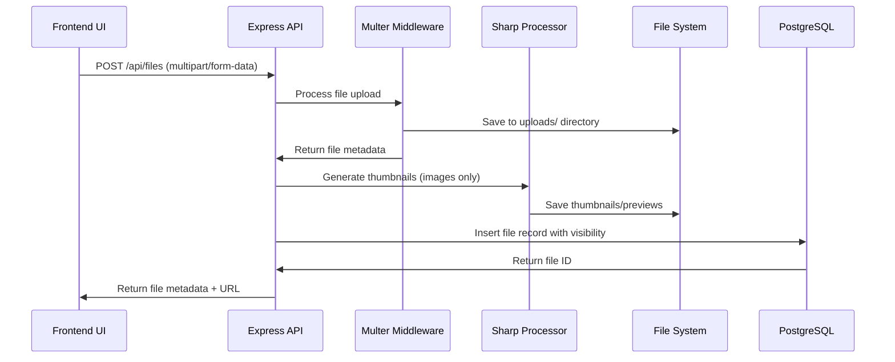
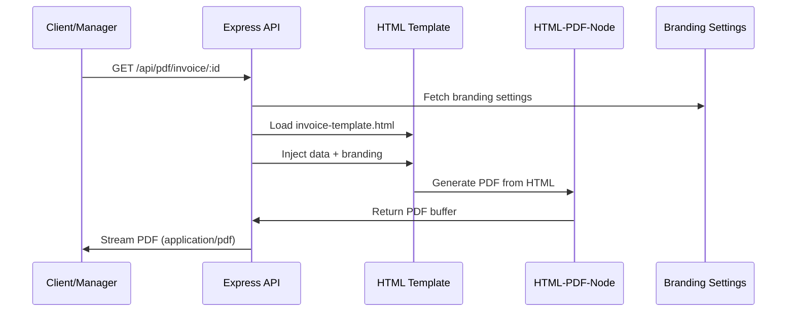
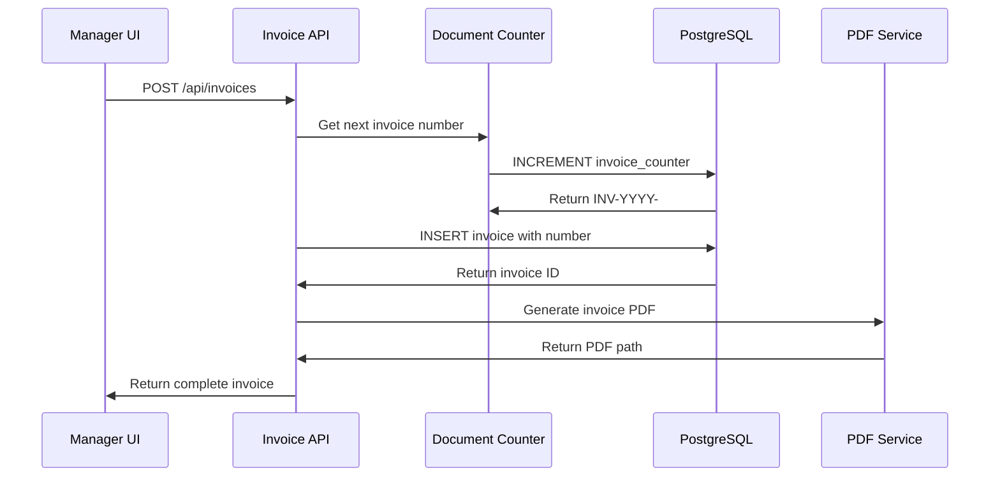
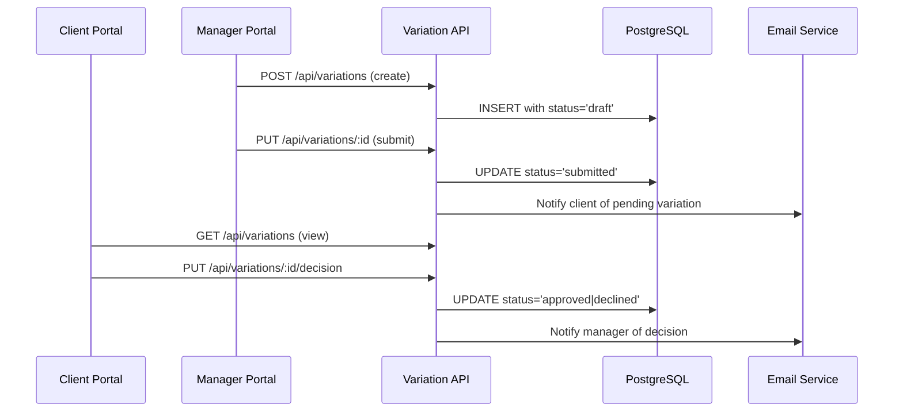

# FireLynx Codebase Overview

## Summary

This document provides a comprehensive technical overview of the FireLynx codebase—a project-centric interior design studio management platform. FireLynx implements dual portals (Manager and Client) with complete project lifecycle management including milestones, variations, approvals, invoices, and file management.

## How to Use This Doc

- **Quick Reference**: Check Component/Module Index for specific file locations
- **Feature Mapping**: Use Feature/Route/API maps to trace data flow from UI to database
- **Architecture Understanding**: Review Key Flows section for critical business processes
- **All claims cited**: File paths and line ranges provided for verification

---

## 1. Repository Structure & Conventions

### Directory Tree
```
FireLynx/
├── src/                           # React frontend application
│   ├── components/                # Reusable UI components
│   │   ├── ui/                   # Core UI primitives (Button, Input, etc.)
│   │   ├── modals/               # Modal components
│   │   ├── cards/                # Card-style components
│   │   └── variations/           # Variation-specific components
│   ├── pages/                    # Route-based page components
│   │   ├── manager-dashboard/    # Manager portal landing
│   │   ├── client-portal/        # Client portal (read-only)
│   │   ├── project-details/      # Individual project views
│   │   ├── projects-list/        # Project listing/grid
│   │   ├── variation-requests/   # Variation management
│   │   ├── ticketing-system/     # Support tickets
│   │   ├── user-management/      # Team management
│   │   └── login/               # Authentication
│   ├── services/                 # API layer
│   ├── hooks/                    # Custom React hooks
│   ├── data/                     # Mock data and helpers
│   ├── styles/                   # CSS and Tailwind configuration
│   └── utils/                    # Utility functions
├── server/                       # Express.js backend
│   ├── routes/                   # API endpoint definitions
│   ├── middleware/               # Custom middleware (diagnostics, etc.)
│   ├── templates/                # PDF generation templates
│   └── utils/                    # Server utilities
├── public/                       # Static assets
├── uploads/                      # File storage (images, documents)
├── drizzle/                      # Database migration files
└── docs/                         # Generated documentation (this file)
```

### Domain Boundaries

**Citations**: `src/Routes.jsx:19-63`, `server/index.js:210-224`

1. **Manager Portal**: Full CRUD operations (`/dashboard`, `/projects`, `/clients`)
2. **Client Portal**: Read-only access with approvals (`/portal/*`)
3. **Project Management**: Central entity with related data (`/projects/*`)
4. **Document Management**: Files, variations, invoices, tickets
5. **PDF Generation**: Branded document creation (`/api/pdf/*`)

### Naming Conventions

**Citations**: `server/database.js:39-274`, `src/data/store.js:16-29`

- **Database Tables**: Snake_case (e.g., `project_team`, `variation_requests`)
- **Document Numbers**: `PREFIX-YYYY-####` (e.g., `INV-2025-0001`, `VR-2025-0002`)
- **React Components**: PascalCase (e.g., `ProjectCard`, `VariationDetailModal`)
- **API Endpoints**: RESTful with resource-based paths (`/api/projects/:id`)
- **File Paths**: Kebab-case for directories, PascalCase for React files

---

## 2. Component/Module Index

| Name | Path | Purpose | Key Exports | Dependencies |
|------|------|---------|-------------|--------------|
| **App.jsx** | `src/App.jsx` | Root application component | App | Routes, ErrorBoundary |
| **Routes.jsx** | `src/Routes.jsx` | Application routing configuration | Routes | React Router v6, All page components |
| **ErrorBoundary.jsx** | `src/components/ErrorBoundary.jsx` | Global error handling | ErrorBoundary | AppIcon |
| **store.js** | `src/data/store.js` | Mock data and utilities | entities, helpers | Auto-numbering logic |
| **api.js** | `src/services/api.js` | API service layer | All API endpoints | Axios |
| **Button.jsx** | `src/components/ui/Button.jsx` | Primary button component | Button | Class variance authority |
| **ProfessionalSidebar.jsx** | `src/components/ui/ProfessionalSidebar.jsx` | Manager navigation | ProfessionalSidebar | Lucide icons |
| **ProjectCard.jsx** | `src/pages/projects-list/components/ProjectCard.jsx` | Project preview card | ProjectCard | Framer Motion |
| **ManagerDashboard** | `src/pages/manager-dashboard/index.jsx` | Manager portal landing | ManagerDashboard | KPI components |
| **ClientPortal** | `src/pages/client-portal/index.jsx` | Client portal view | ClientPortal | Project components |
| **database.js** | `server/database.js` | Database schema & connection | db, all tables | Drizzle ORM, PostgreSQL |
| **index.js** | `server/index.js` | Express server setup | app | All middleware, routes |
| **projects.js** | `server/routes/projects.js` | Project API endpoints | router | Database queries |
| **variations.js** | `server/routes/variations.js` | Variation API endpoints | router | Database, PDF generation |

---

## 3. Feature ↔ Route ↔ API Mapping

### Manager Portal Features

| Feature | Frontend Route | Components | Backend Route | Controller/Service | DB Tables |
|---------|---------------|------------|---------------|-------------------|-----------|
| **Dashboard** | `/dashboard` | `ManagerDashboard`, `KPICard` | `/api/projects`, `/api/tickets` | `projects.js:67-95` | `projects`, `tickets`, `invoices` |
| **Project List** | `/projects` | `ProjectsList`, `ProjectCard` | `/api/projects` | `projects.js:67-95` | `projects`, `clients` |
| **Project Details** | `/projects/:id` | `ProjectDetails`, `ProjectOverview` | `/api/projects/:id` | `projects.js:97-125` | `projects`, `milestones`, `fileAssets` |
| **Milestones** | `/projects/:id` (tab) | `ProjectMilestones`, `MilestoneCard` | `/api/milestones` | `milestones.js` | `milestones`, `milestoneFiles` |
| **Variations** | `/variations` | `VariationRequestsPage` | `/api/variations` | `variations.js` | `variationRequests`, `variationFiles` |
| **Invoices** | `/invoices` | `InvoicesGlobal` | `/api/invoices` | `invoices.js` | `invoices` |
| **File Management** | All project pages | `FileCard`, `FileUploadModal` | `/api/files` | `files.js` | `fileAssets`, `milestoneFiles` |

### Client Portal Features

| Feature | Frontend Route | Components | Backend Route | Controller/Service | DB Tables |
|---------|---------------|------------|---------------|-------------------|-----------|
| **Client Dashboard** | `/portal` | `ClientPortal`, `ModernLayout` | `/api/projects` (filtered) | `projects.js` with visibility | `projects`, `milestones` |
| **Project View** | `/portal/projects/:id` | `ClientMilestoneCard` | `/api/projects/:id` | `projects.js` (client view) | `projects`, `fileAssets` |
| **Approvals** | `/portal` (tab) | `EnhancedApprovals` | `/api/approvals` | `approvals.js` | `approvalPackets`, `approvalItems` |
| **Variations Review** | `/portal` (tab) | `ClientVariationApproval` | `/api/variations` | `variations.js` (read-only) | `variationRequests` |

### PDF Generation Features

| Feature | Frontend Trigger | Components | Backend Route | Controller/Service | Templates |
|---------|------------------|------------|---------------|-------------------|-----------|
| **Invoice PDF** | Invoice details page | PDF download button | `/api/pdf/invoice/:id` | `pdf-html.js:15-45` | `invoice-template.html` |
| **Variation PDF** | Variation details | PDF download | `/api/pdf/variation/:id` | `pdf-html.js:47-77` | `variation-template.html` |
| **Approval PDF** | Approval packet | Certificate generation | `/api/pdf/approval/:id` | `pdf-html.js:79-109` | Dynamic HTML |

**Citations**: `src/Routes.jsx:19-63`, `server/index.js:210-224`, `src/services/api.js:66-252`

---

## 4. Design System & Global Patterns

### CSS Variables & Tokens

**Citations**: `src/styles/tailwind.css:8-63`, `tailwind.config.js:19-114`

```css
/* Core color system */
--color-primary: #2D3748;        /* Deep charcoal */
--color-accent: #3182CE;         /* Confident blue */
--color-success: #38A169;        /* Natural green */
--color-warning: #D69E2E;        /* Warm amber */
--color-error: #E53E3E;          /* Clear red */
--color-background: #FAFAFA;     /* Warm off-white */
--color-muted: #F7FAFC;          /* Very light gray */
```

### Global Error Boundaries

**Citations**: `src/components/ErrorBoundary.jsx:4-55`, `src/Routes.jsx:22`

- **ErrorBoundary**: Wraps entire app, provides user-friendly error UI
- **Global Error Handler**: Server-side error middleware (`server/index.js:234-251`)

### State Management

**Citations**: `src/data/store.js:1-646`

- **Mock Data Store**: Client-side state with entities matching database schema
- **Helper Functions**: Data relationships and utilities
- **Auto-numbering**: Local implementation of document numbering system

---

## 5. Middleware & Security

### Express Middleware Stack

**Citations**: `server/index.js:16-151`

1. **Trust Proxy**: Replit environment support (`server/index.js:20`)
2. **Helmet**: Security headers with CSP (`server/index.js:17-72`)
3. **CORS**: Cross-origin policy for Replit domains (`server/index.js:74-89`)
4. **Rate Limiting**: 1000 requests per 15 minutes (`server/index.js:95-99`)
5. **Diagnostics**: Request/response logging (`server/index.js:147-155`)

### File Upload Flow

**Citations**: `server/index.js:101-135`, `server/routes/files.js`

1. **Multer Configuration**: Disk storage with unique filenames
2. **File Validation**: Type and size restrictions (50MB limit)
3. **Sharp Processing**: Thumbnail generation for images
4. **Visibility Control**: Client/Internal access levels

---

## 6. Key Business Flows

### File Upload Flow



**Citations**: `server/index.js:101-135`, `server/routes/files.js:45-89`

### PDF Generation Flow



**Citations**: `server/routes/pdf-html.js:15-45`, `server/templates/invoice-template.html`

### Invoice Creation Flow



**Citations**: `server/routes/invoices.js:95-145`, `server/database.js:267-274`

### Variation Approval Flow



**Citations**: `server/routes/variations.js:45-125`, `src/components/variations/ClientVariationApproval.jsx`

---

## 7. Database Integration

### Auto-Numbering System

**Citations**: `server/database.js:267-274`, `src/data/store.js:16-29`

- **Document Types**: INV (invoices), VR (variations), AP (approvals), TK (tickets)
- **Format**: `PREFIX-YYYY-####` with zero padding
- **Yearly Reset**: Counters reset each calendar year
- **Transaction Safety**: Atomic increment operations

### Visibility Controls

**Citations**: `server/database.js:112`, `server/database.js:223`

- **File Visibility**: `Client` | `Internal` controls client portal access
- **Project Isolation**: All entities linked via `projectId` foreign key
- **Team Access**: Project team membership controls data visibility

---

## Questions / Unknowns

1. **Authentication System**: Routes suggest auth system but implementation not visible in codebase
2. **Email Service**: Email notifications mentioned in flows but service implementation unclear
3. **Real-time Updates**: WebSocket/polling strategy for live updates not documented
4. **File Storage**: Production deployment strategy (local vs S3/cloud storage)
5. **Error Logging**: Structured logging/monitoring setup beyond console.log
6. **API Rate Limiting**: Current 1000/15min threshold - is this appropriate for production?
7. **Database Migrations**: Drizzle migration strategy vs direct schema push in production
8. **Background Jobs**: PDF generation appears synchronous - any async processing?

---

## Next Steps

- **Phase 2**: Database & Data Flow analysis with ER diagrams
- **Phase 3**: Complete OpenAPI specification generation
- **Phase 4**: Security audit of upload/PDF/auth flows
- **Phase 5**: Test strategy and coverage analysis
- **Phase 6**: Roadmap with observability and scalability improvements

---

*Generated: Phase 1 of 6 - Codebase Discovery & Index*  
*All file references verified as of repository analysis*