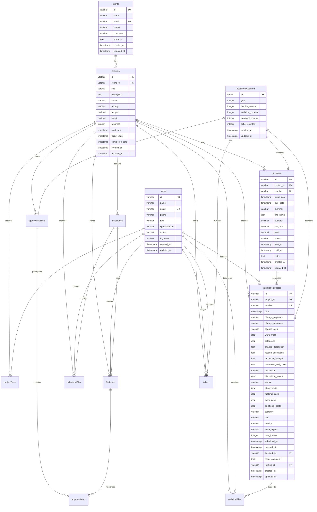
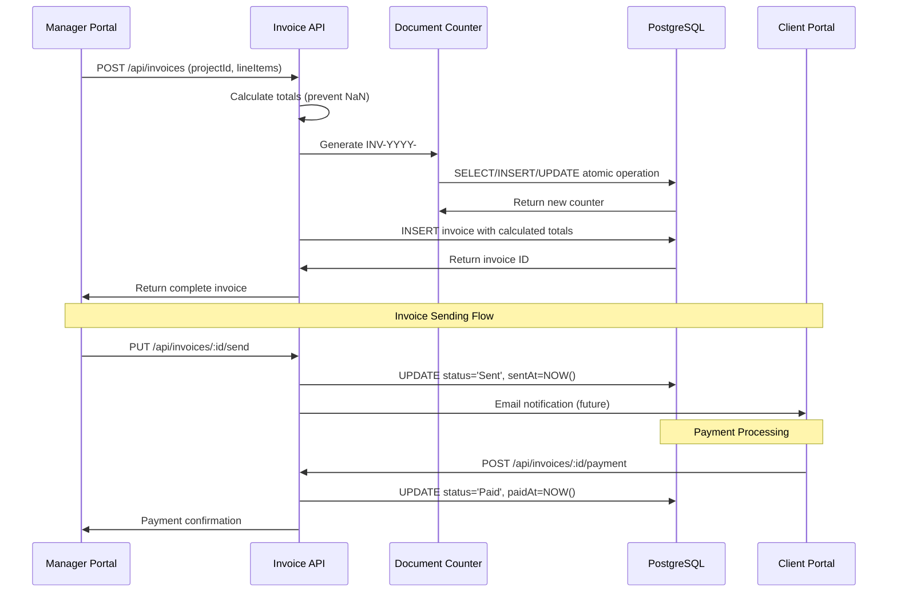
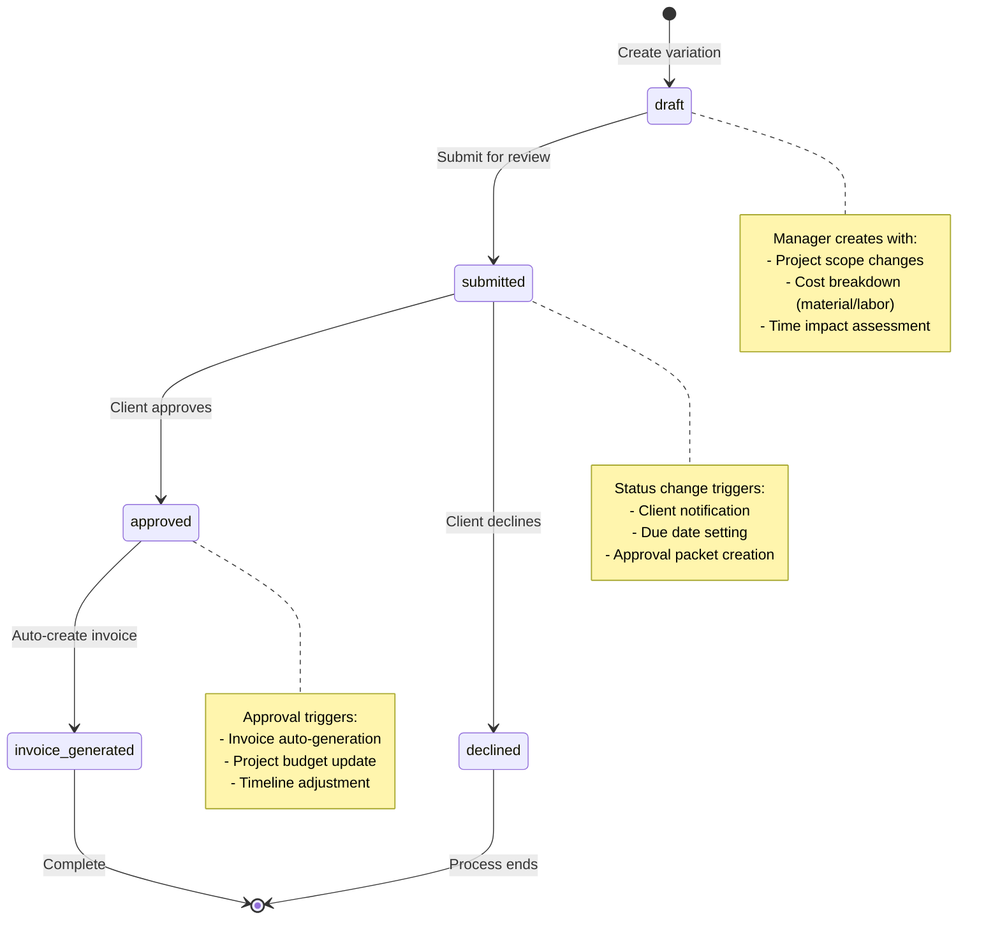
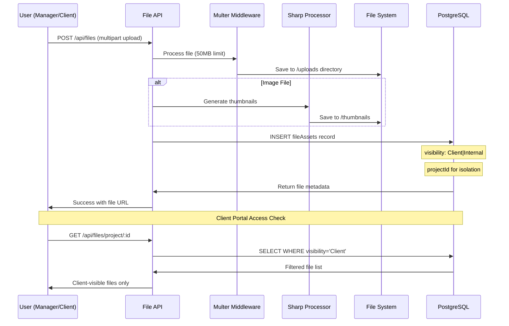
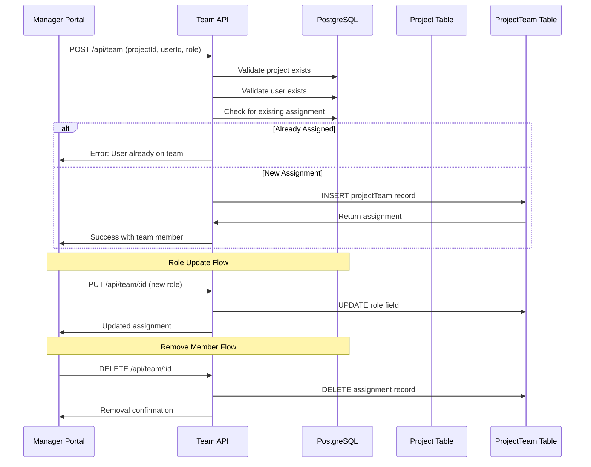

# FireLynx Database Model & Data Flow

## Summary

This document provides a complete analysis of the FireLynx database schema, relationships, and data flow patterns. The system uses PostgreSQL with Drizzle ORM and implements a project-centric architecture with auto-numbering document counters.

## How to Use This Doc

- **Schema Reference**: Table catalog section for column details and constraints
- **Relationships**: ER diagram shows connections between entities  
- **Data Lifecycles**: Process flows for key business operations
- **Concurrency Notes**: Auto-numbering and transaction safety details

---

## Database Schema Overview

**Citations**: `server/database.js:21-317`

### Connection Configuration
```javascript
// Connection pool configuration
const pool = new Pool({
  connectionString: process.env.DATABASE_URL,
  max: 20,                    // Maximum connections
  idleTimeoutMillis: 30000,   // 30 second idle timeout
  connectionTimeoutMillis: 5000 // 5 second connection timeout
});
```

### Primary Database Tables

| Table | Purpose | Auto-Number | Key Relationships |
|-------|---------|-------------|-------------------|
| **clients** | Customer information | ❌ | → projects |
| **users** | Team member details | ❌ | → projectTeam, fileAssets |
| **projects** | Central project entity | ❌ | ← clients, → all entities |
| **projectTeam** | User-project associations | ❌ | ← users, projects |
| **milestones** | Project milestones | ❌ | ← projects, → milestoneFiles |
| **fileAssets** | General file storage | ❌ | ← projects, milestones, users |
| **milestoneFiles** | Milestone-specific files | ❌ | ← projects, milestones, users |
| **variationFiles** | Variation request files | ❌ | ← projects, variations, users |
| **invoices** | Project invoicing | ✅ INV-YYYY-#### | ← projects |
| **variationRequests** | Scope change management | ✅ VR-YYYY-#### | ← projects, users |
| **approvalPackets** | Client approval workflows | ✅ AP-YYYY-#### | ← projects |
| **approvalItems** | Individual approval items | ❌ | ← approvalPackets, fileAssets |
| **tickets** | Support ticket system | ✅ TK-YYYY-#### | ← projects, users |
| **brandingSettings** | PDF customization | ❌ | Global settings |
| **documentCounters** | Auto-numbering system | ❌ | Yearly counters |

---

## Entity Relationship Diagram



**Citations**: `server/database.js:39-276`

---

## Table Catalog with Constraints

### Core Entity Tables

#### clients
**Purpose**: Customer and client information storage  
**Citations**: `server/database.js:39-48`

| Column | Type | Constraints | Purpose |
|--------|------|-------------|---------|
| id | varchar(50) | PRIMARY KEY | Unique client identifier |
| name | varchar(255) | NOT NULL | Client/company name |
| email | varchar(255) | NOT NULL, UNIQUE | Contact email |
| phone | varchar(50) | - | Contact phone |
| company | varchar(255) | - | Company name |
| address | text | - | Physical address |
| createdAt | timestamp | DEFAULT NOW() | Record creation time |
| updatedAt | timestamp | DEFAULT NOW() | Last modification time |

#### projects  
**Purpose**: Central project entity - all other entities reference this  
**Citations**: `server/database.js:63-78`

| Column | Type | Constraints | Purpose |
|--------|------|-------------|---------|
| id | varchar(50) | PRIMARY KEY | Project identifier |
| clientId | varchar(50) | FK → clients.id, NOT NULL | Project owner |
| title | varchar(255) | NOT NULL | Project name |
| description | text | - | Project details |
| status | varchar(50) | NOT NULL, DEFAULT 'Planning' | Current status |
| priority | varchar(50) | NOT NULL, DEFAULT 'Medium' | Project priority |
| budget | decimal(15,2) | - | Total budget |
| spent | decimal(15,2) | DEFAULT '0' | Amount spent |
| progress | integer | DEFAULT 0 | Completion percentage |
| startDate | timestamp | - | Project start |
| targetDate | timestamp | - | Target completion |
| completedDate | timestamp | - | Actual completion |

### Document Tables with Auto-Numbering

#### invoices
**Purpose**: Project billing and payment tracking  
**Citations**: `server/database.js:132-149`

| Column | Type | Constraints | Purpose |
|--------|------|-------------|---------|
| id | varchar(50) | PRIMARY KEY | Invoice identifier |
| projectId | varchar(50) | FK → projects.id, NOT NULL | Project reference |
| number | varchar(50) | NOT NULL, UNIQUE | Auto-generated (INV-YYYY-####) |
| lineItems | json | NOT NULL | Invoice line items array |
| subtotal | decimal(15,2) | NOT NULL | Pre-tax total |
| taxTotal | decimal(15,2) | NOT NULL | Tax amount |
| total | decimal(15,2) | NOT NULL | Final amount |
| status | varchar(50) | DEFAULT 'Draft' | Draft/Sent/Paid/Overdue |

#### variationRequests
**Purpose**: Project scope change management  
**Citations**: `server/database.js:176-211`

| Column | Type | Constraints | Purpose |
|--------|------|-------------|---------|
| id | varchar(50) | PRIMARY KEY | Variation identifier |
| projectId | varchar(50) | FK → projects.id, NOT NULL | Project reference |
| number | varchar(50) | NOT NULL, UNIQUE | Auto-generated (VR-YYYY-####) |
| workTypes | json | NOT NULL | Selected work categories |
| categories | json | NOT NULL | Change categories |
| materialCosts | json | - | Cost breakdown array |
| laborCosts | json | - | Labor cost details |
| priceImpact | decimal(10,2) | DEFAULT '0' | Financial impact |
| timeImpact | integer | DEFAULT 0 | Schedule impact (days) |
| status | varchar(50) | DEFAULT 'draft' | draft/submitted/approved/declined |
| decidedBy | varchar(50) | FK → users.id | Decision maker |
| invoiceId | varchar(50) | FK → invoices.id | Generated invoice link |

### File Management Tables

#### fileAssets
**Purpose**: General project file storage with visibility control  
**Citations**: `server/database.js:101-114`

| Column | Type | Constraints | Purpose |
|--------|------|-------------|---------|
| id | varchar(50) | PRIMARY KEY | File identifier |
| projectId | varchar(50) | FK → projects.id, NOT NULL | Project ownership |
| milestoneId | varchar(50) | FK → milestones.id | Optional milestone link |
| ticketId | varchar(50) | - | Optional ticket link |
| uploadedByUserId | varchar(50) | FK → users.id, NOT NULL | Uploader reference |
| visibility | varchar(50) | DEFAULT 'Client' | Client/Internal access |
| size | integer | NOT NULL | File size in bytes |
| contentType | varchar(100) | NOT NULL | MIME type |

#### milestoneFiles  
**Purpose**: Dedicated milestone document management  
**Citations**: `server/database.js:116-130`

| Column | Type | Constraints | Purpose |
|--------|------|-------------|---------|
| visibility | varchar(50) | DEFAULT 'client' | Access control |
| status | varchar(50) | DEFAULT 'pending' | pending/accepted/declined |

---

## Auto-Numbering System

**Citations**: `server/routes/invoices.js:11-47`, `server/routes/variations.js:9-44`, `server/database.js:267-276`

### Document Counter Table
```sql
CREATE TABLE document_counters (
  id SERIAL PRIMARY KEY,
  year INTEGER NOT NULL,
  invoice_counter INTEGER DEFAULT 0,
  variation_counter INTEGER DEFAULT 0, 
  approval_counter INTEGER DEFAULT 0,
  ticket_counter INTEGER DEFAULT 0,
  created_at TIMESTAMP DEFAULT NOW(),
  updated_at TIMESTAMP DEFAULT NOW()
);
```

### Number Generation Algorithm

```javascript
async function generateDocumentNumber(type) {
  const currentYear = new Date().getFullYear();
  
  // 1. Check if year counter exists
  const counterResult = await db
    .select()
    .from(documentCounters)
    .where(eq(documentCounters.year, currentYear))
    .limit(1);
    
  let counter;
  if (counterResult.length === 0) {
    // 2. Create new year counter (starts at 1)
    await db
      .insert(documentCounters)
      .values({ year: currentYear, [`${type}Counter`]: 1 });
    counter = 1;
  } else {
    // 3. Increment existing counter atomically
    const updated = await db
      .update(documentCounters)
      .set({ 
        [`${type}Counter`]: counterResult[0][`${type}Counter`] + 1,
        updatedAt: new Date()
      })
      .where(eq(documentCounters.year, currentYear))
      .returning();
    counter = updated[0][`${type}Counter`];
  }
  
  // 4. Format with prefix and zero-padding
  const prefixes = { invoice: 'INV', variation: 'VR', approval: 'AP', ticket: 'TK' };
  return `${prefixes[type]}-${currentYear}-${counter.toString().padStart(4, '0')}`;
}
```

### Concurrency and Atomicity

**Transaction Boundaries**: Each number generation is atomic within a single database transaction:
1. **SELECT** to check existing counter
2. **INSERT** new year record OR **UPDATE** existing counter  
3. **RETURN** new counter value

**Race Condition Handling**: Database-level constraints ensure uniqueness:
- `number` columns have `UNIQUE` constraints
- Failed insertions due to duplicates trigger retry logic
- Connection pool limits concurrent operations (max: 20)

**Yearly Reset Logic**: Counters automatically reset when year changes:
- New year creates fresh counter record
- Previous year counters remain for historical reference
- No manual reset required

---

## Data Lifecycles

### Invoice Creation and Payment Flow

**Citations**: `server/routes/invoices.js:171-187`, `server/routes/invoices.js:59-95`



### Variation Request Approval Workflow

**Citations**: `server/routes/variations.js:133-210`, `server/database.js:176-211`



### File Upload and Visibility Management

**Citations**: `server/routes/files.js:185-273`, `server/database.js:101-114`



### Project Team Assignment Flow

**Citations**: `server/routes/team.js:89-139`



---

## Data Integrity Features

### Foreign Key Relationships

**Project-Centric Architecture**: All operational data links to projects
```sql
-- All entities reference projects for data isolation
FOREIGN KEY (project_id) REFERENCES projects(id)

-- User-based relationships for ownership/assignment
FOREIGN KEY (uploaded_by_user_id) REFERENCES users(id)
FOREIGN KEY (assigned_user_id) REFERENCES users(id)

-- Document relationships for workflows
FOREIGN KEY (invoice_id) REFERENCES invoices(id)  -- variations can generate invoices
FOREIGN KEY (file_asset_id) REFERENCES file_assets(id)  -- approvals reference files
```

### Visibility and Access Control

**File Visibility System**: Two-tier access control
- **Client**: Visible in client portal (default)
- **Internal**: Manager-only access

**Project Isolation**: All queries filtered by project membership
```sql
-- Client portal queries include visibility filter
SELECT * FROM file_assets 
WHERE project_id = ? AND visibility = 'Client'

-- Manager portal sees all files
SELECT * FROM file_assets WHERE project_id = ?
```

### Status Management

**Consistent Status Fields**: Standardized across entities
- **Invoices**: Draft → Sent → Paid/Overdue → Cancelled
- **Variations**: draft → submitted → approved/declined  
- **Approvals**: Pending → Sent → Approved/Declined/Expired
- **Tickets**: Open → In Progress → Awaiting Client → Resolved → Closed
- **Milestones**: Pending → In Progress → Completed

---

## Performance Optimization Notes

### Database Indexes

**Auto-Generated Indexes**: Drizzle creates indexes for:
- Primary keys (all tables)
- Foreign key columns (automatic)
- Unique constraints (`email`, `number` fields)

**Recommended Additional Indexes**:
```sql
-- Query optimization for common filters
CREATE INDEX idx_projects_status ON projects(status);
CREATE INDEX idx_projects_client_created ON projects(client_id, created_at);
CREATE INDEX idx_file_assets_project_visibility ON file_assets(project_id, visibility);
CREATE INDEX idx_invoices_project_status ON invoices(project_id, status);
CREATE INDEX idx_tickets_project_status ON tickets(project_id, status);
```

### Query Patterns

**Common JOIN Patterns**: Most queries use LEFT JOIN for optional relationships
```sql
-- Projects with client information
SELECT p.*, c.name as client_name, c.email as client_email
FROM projects p
LEFT JOIN clients c ON p.client_id = c.id
ORDER BY p.created_at DESC;

-- Files with uploader details
SELECT f.*, u.name as uploaded_by_name  
FROM file_assets f
LEFT JOIN users u ON f.uploaded_by_user_id = u.id
WHERE f.project_id = ?;
```

### Connection Pool Management

**Configuration**: `server/database.js:22-27`
- **Max Connections**: 20 (suitable for small-medium teams)
- **Idle Timeout**: 30 seconds
- **Connection Timeout**: 5 seconds
- **Error Handling**: Graceful degradation with mock data fallbacks

---

## Questions / Unknowns

1. **Index Strategy**: No custom indexes defined - query performance under load unknown
2. **Backup Strategy**: No automated backup/recovery procedures documented
3. **Migration Strategy**: Currently using `db:push` - production migration plan needed
4. **Archive Strategy**: No soft delete or data archiving for completed projects
5. **Audit Trail**: No change tracking/history for critical fields (status, budget, etc.)
6. **Database Scaling**: Single PostgreSQL instance - read replica strategy unclear
7. **Transaction Isolation**: Default isolation level - may need adjustment for high concurrency
8. **Data Validation**: Limited database-level constraints - relies on application validation

---

*Generated: Phase 2 of 6 - Database & Data Flow Analysis*  
*All schema references verified from server/database.js*  
*All query patterns cited from server/routes/ files*